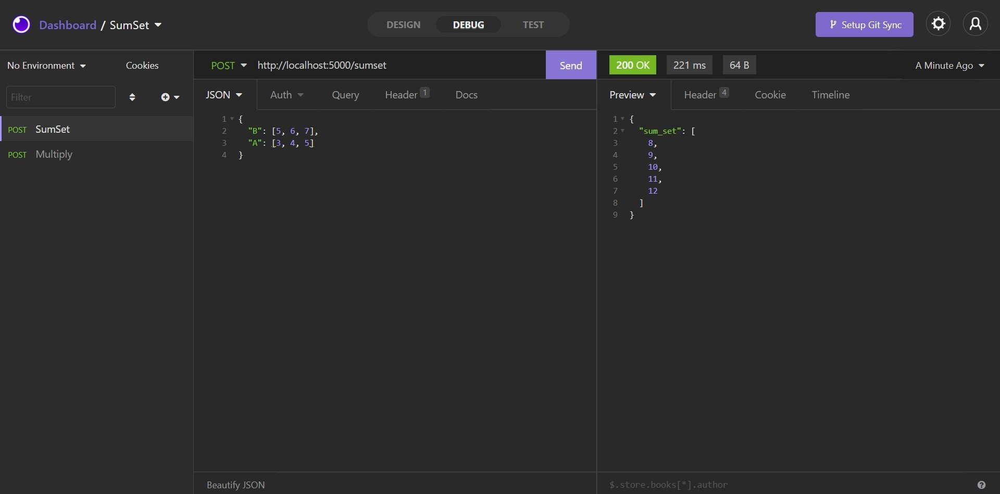
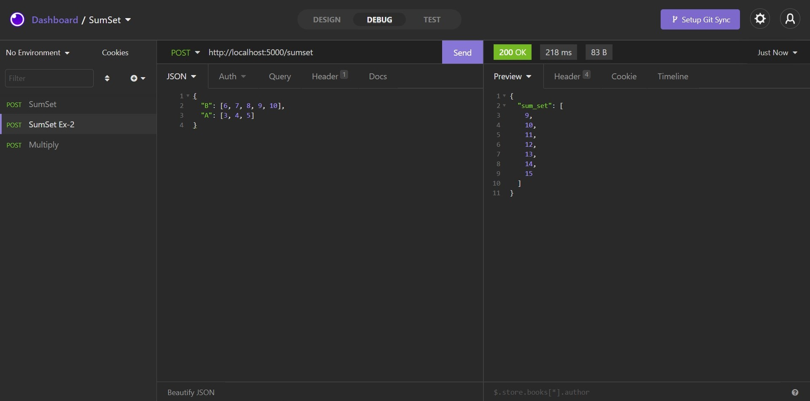
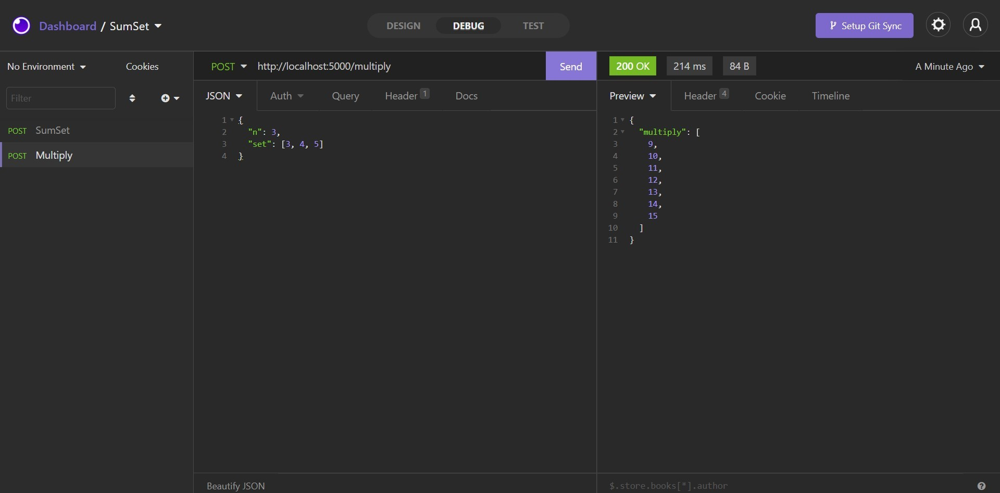

# SumSet

**Número da Lista**: 20 
**Conteúdo da Disciplina**: D&C 

## Alunos

| Matrícula  | Aluno                           |
| ---------- | ------------------------------- |
| 18/0054848 | Rhuan Carlos Pereira de Queiroz |
| 18/0028308 | Thiago Guilherme Muniz Ferreira |

## Sobre

É uma API (Application Programming Interface) baseada no problema matemático de Sum Set, soma de conjuntos, vide [Wikipedia](https://en.wikipedia.org/wiki/Sumset).

A lógica da solução consiste em utilizar funções geradoras para representar os conjuntos,
e ao multiplicar os polinômios, se obtém o resultado da soma dos conjuntos. Para efetuar a multiplicação de um conjunto por um escalar, que é equivalente a aplicar a soma com ele mesmo n vezes, foi utilizado a abordagem semelhante a exponenciação rápida.

## Screenshots

## Instalação

**Linguagem**: Python

**Framework**: Flask

Docker e Docker-Compose

### Build dos containers

`docker-compose build`

### Execução do serviço

`docker-compose up`

## Uso

Para usar a API, provavelmente você precisará de um aplicativo que seja capaz de consumir a API. Exemplo: Postman, Insomnia, etc.

Os endpoints disponíveis são:

    - POST /sumset
    - POST /multiply

Os padrões de requisição obedecem aos screenshots acima.

## Outros

Se você não tiver Docker, lamentamos, terá que instalar os pacotes:

`pip3 install -r requirements.txt`
